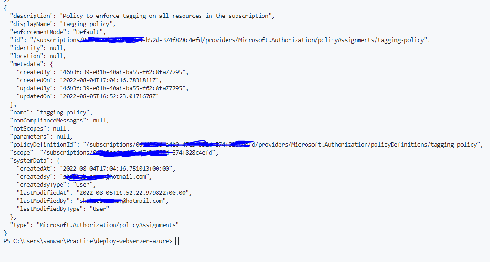
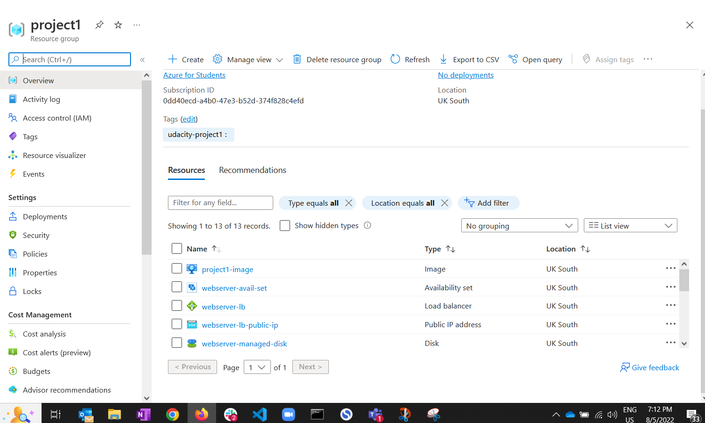

# Azure Infrastructure Operations Project: Deploying a scalable IaaS web server in Azure

### Introduction
Using this repo, you can deploy a scalable webserver in Azure using Infrastructure as a Code (IaC) techniques. The code uses HashiCorp's [Terraform](https://www.ter.raform.io/) to deploy a webserver in Azure. The virtual machine template is created using [Packer](https://www.packer.io/) while the Microsoft's [Azure CLI](https://azure.microsoft.com/en-us/documentation/articles/cli/) is used to deploy the virtual machine like a script. Let's start!

### Getting Started
1. Clone this repository

2. Create your infrastructure as code

3. Update this README to reflect how someone would use your code.

### Dependencies
1. Create an [Azure Account](https://portal.azure.com) 
2. Install the [Azure command line interface](https://docs.microsoft.com/en-us/cli/azure/install-azure-cli?view=azure-cli-latest)
3. Install [Packer](https://www.packer.io/downloads)
4. Install [Terraform](https://www.terraform.io/downloads.html)

### Instructions
After fulfilling the dependencies, you can follow the steps below to deploy a webserver in Azure.

1. Clone this repository using `git clone`
2. Open the Azure Cli and login to your Azure account using `az login`
3. Create a resource group using:

```bash
az group create --name udacity-project1 --location francecentral --tags "udacity=project1"
```

4. Create and deploy the custom policy using:

```bash
 az policy definition create --name "tagging-policy" --display-name "Tagging-policy" --description "Enforcing all resource to have tags" --rules "policy.json" --mode All

 az policy assignment create --policy tagging-policy --name "tagging-policy"  --display-name "Tagging policy" --description "Policy to enforce tagging on all resources in the subscription"
```

 5. Verify the deployment using `az policy assignment list`. The output should be something like this:
 


 6. Packer needs some enviornment variables which you can obtain by running the following command:

```bash
  az ad sp create-for-rbac --role Contributor --scopes /subscriptions/<subscription_id> --query "{ client_id: appId, client_secret: password}"  
 ```
 you can use these values inside the `packer.json` file's variables section or you can import them into your `.env` file using 
```
    export ARM_CLIENT_ID=<client_id>
    export ARM_CLIENT_SECRET=<client_secret>
    export ARM_SUBSCRIPTION_ID=<subscription_id>
 ```
 
 7. Now built the packer template using `packer build .\server.json`.This will take sometime and you will see the image inside the resource group. You can use the `az image list` command to verify the deployment. Alrernatively you could also see on the Azure portal which will look something like this:
 

8. Now, since the stage is ready, it's time to deploy the webserver. Use the following command to deploy the webserver:

```bash
terraform init
terraform import azurerm_resource_group.main /subscriptions/<subscription_id>/resourceGroups/udacity-project1
terraform plan -out solution.plan
terraform apply solution.plan
```
9. To verify the deployment, use the following command:

```bash
terraform show
```
10. To delete the deployment, use the following command:

```bash
terraform destroy
``` 

It will ask for a confirmation before deleting the deployment in a following manner:


### Output
The output of the deployment will look something like this:
 

